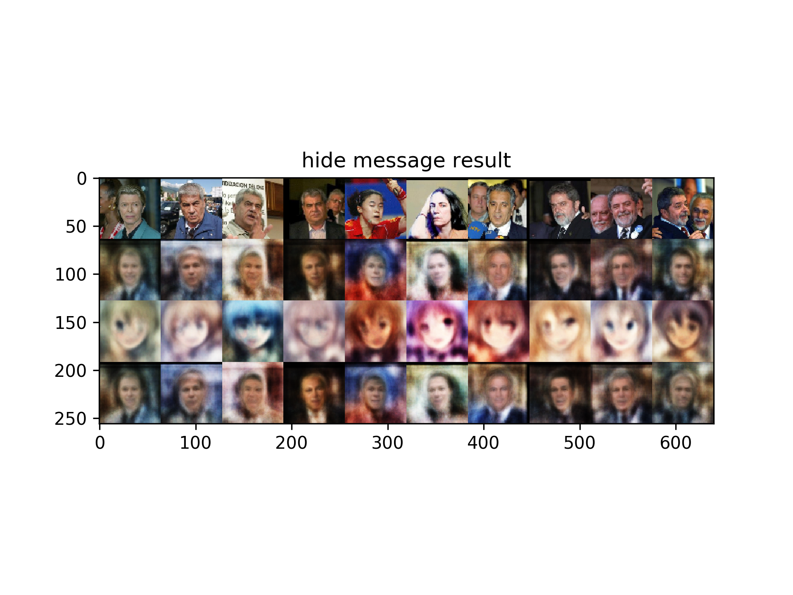

# AAE
This is an implementation of AAE(adversarial auto-encoder) designed to find potential map between different type of images. 

For example, we use human faces dataset and anime faces dataset to train two model separately. In the end, we could encrypt a human face into a anime face and decrypt it if necessary.

# Result

## Fake Human Faces Generated by Model

## Fake Anime Faces Generated by Model

## Image Encrypt Result

## Anime Faces Reconstruct Result

# Dataset

We use the [LFW](http://vis-www.cs.umass.edu/lfw/) dataset to train our human face model.

To gather anime faces data from internet please run `python3 anime.py` to download images from a Japan famous anime image website [konachan.net - Konachan.com Anime Wallpapers](https://link.zhihu.com/?target=http%3A//konachan.net/). Then run `python3 detect.py` to capture faces in those images

# Train

Please run `python3 main.py`

# Environment

python3.x + keras2.1.2 + tensorflow1.3

# Reference

[https://github.com/eriklindernoren/Keras-GAN/blob/master/aae/aae.py](https://github.com/eriklindernoren/Keras-GAN/blob/master/aae/aae.py)